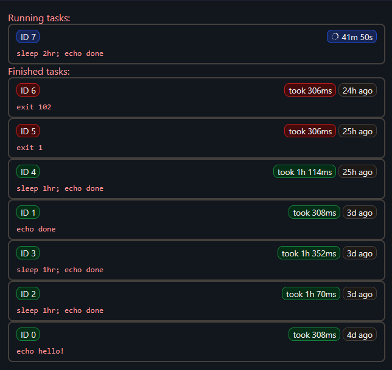

# pueue-ui

an experimental web ui for [pueue](https://github.com/Nukesor/pueue)

> [!CAUTION]
> the api is completely unsafe and CANNOT not be made available over the internet,
unless you want people to be able to run arbitrary commands on your machine.

## status

- [ ] status page
- [ ] task details page
  - [ ] logs
- [ ] task management (add, kill, pause, resume, restart, etc.)

## arch

one needs a tcp connection to communicate with the pueued daemon, meaning that it can't be done in the browser alone.

therefore there's two components; a node server for communicating with the daemon and a vue frontend for displaying
data.
